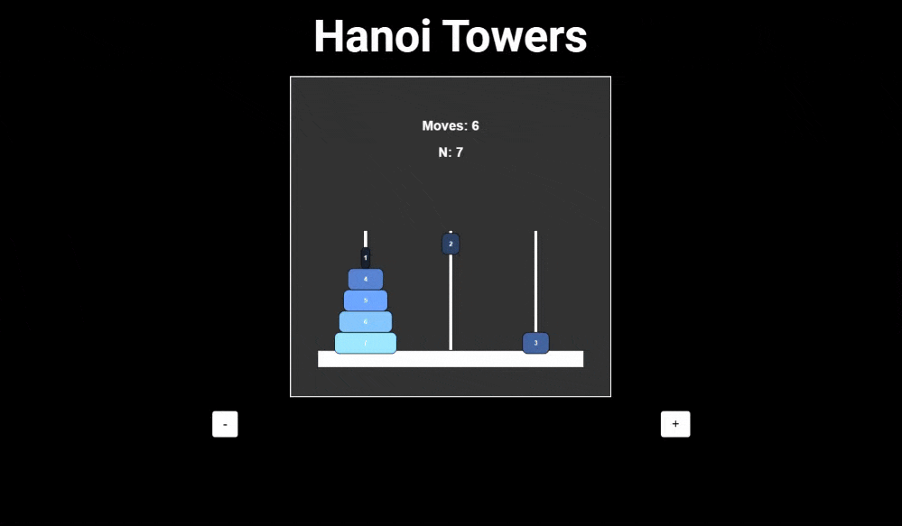

# Hanoi Towers

This project is an implementation of the classic Tower of Hanoi puzzle using p5.js. The objective is to move all the disks from the source rod to the destination rod, following the rules of the game. This visualization helps in understanding the recursive solution to the problem.

## Features

- Interactive visualization of the Tower of Hanoi puzzle.
- Adjustable number of disks.
- Step-by-step solution display.

## Technologies Used

- p5.js
- JavaScript

## Showcase

